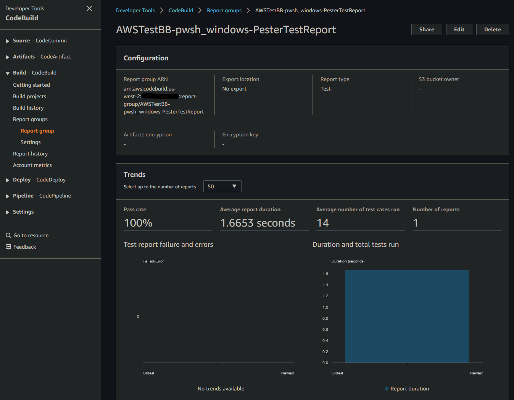
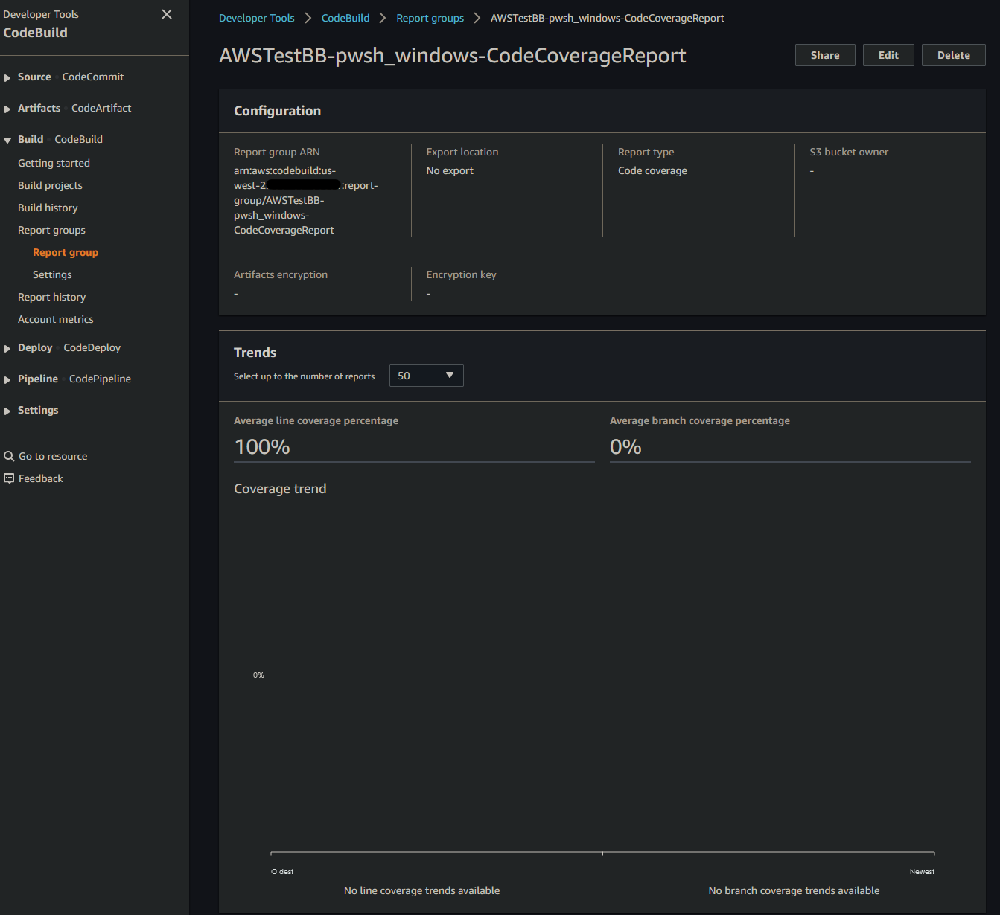
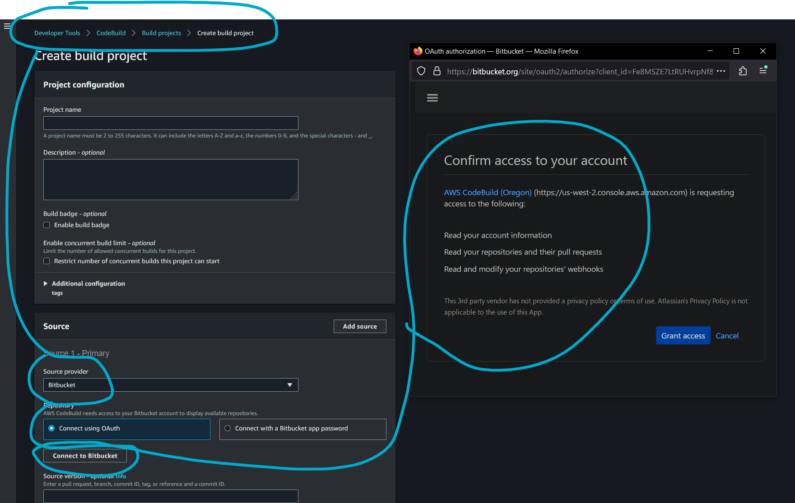
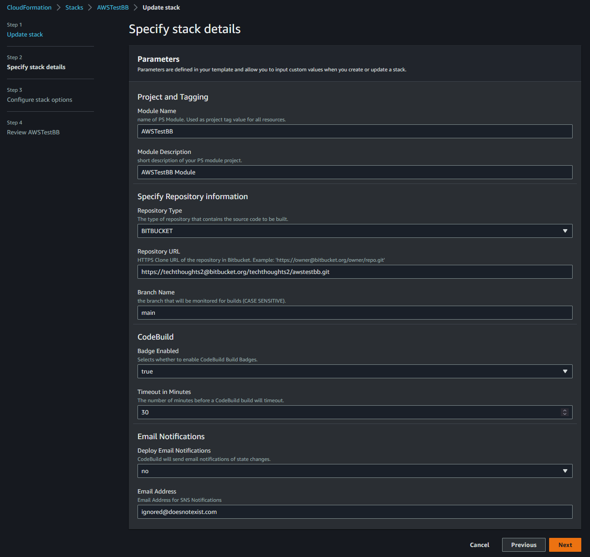
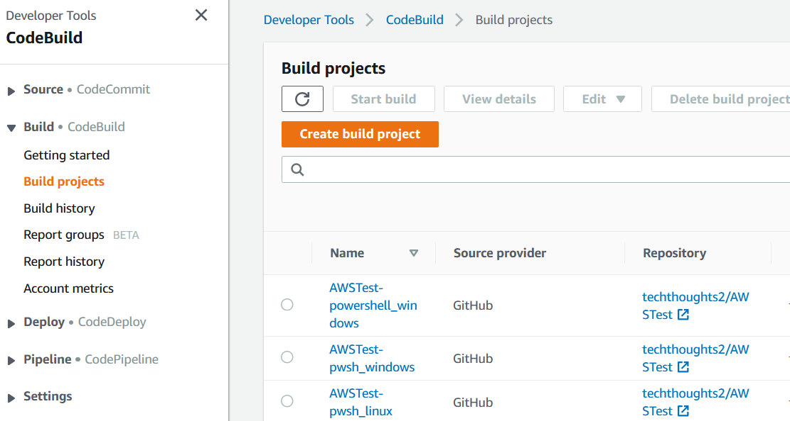
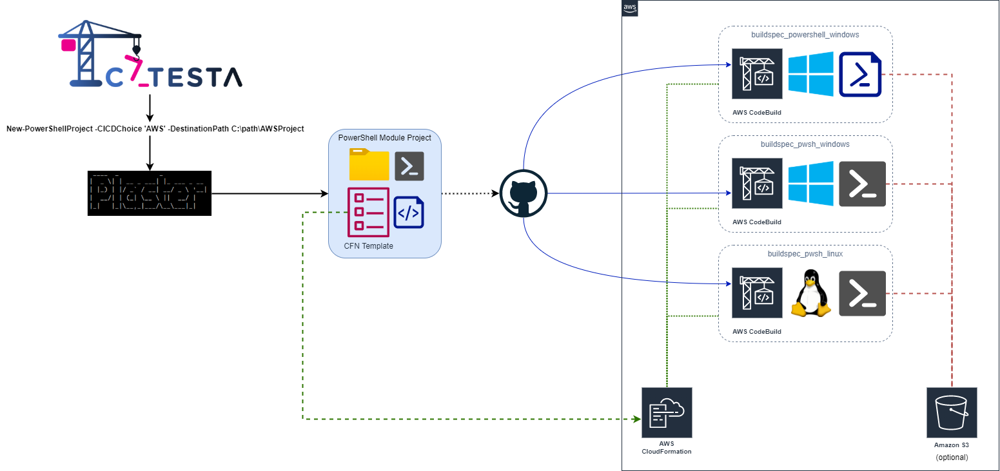
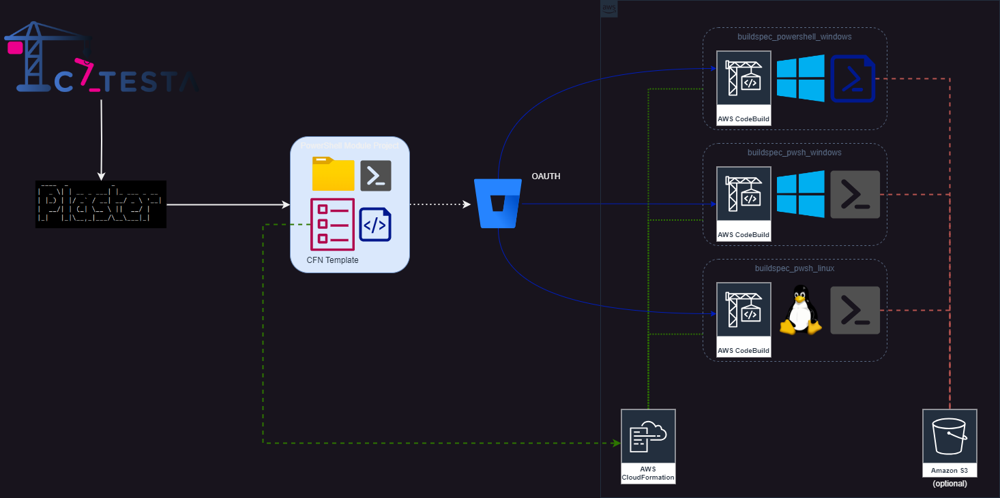
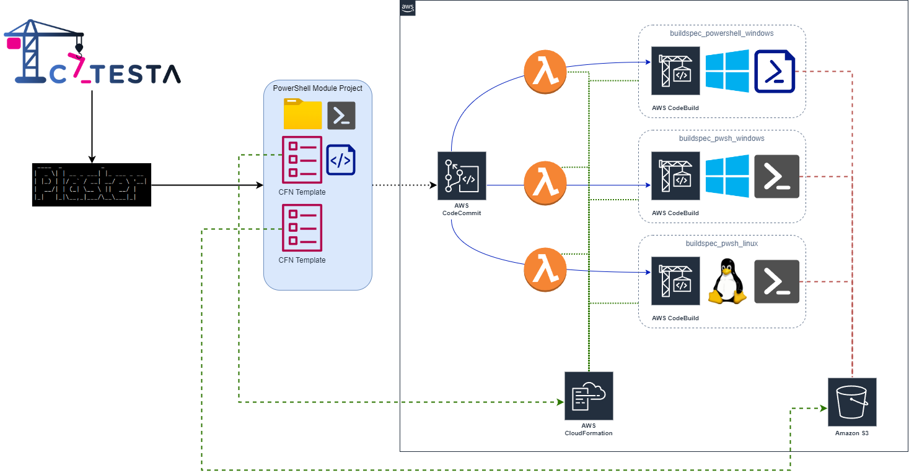

# Catesta - AWS CodeBuild Integration

## Synopsis

Scaffolds a new PowerShell module or vault project intended for CI/CD workflow using [AWS CodeBuild](https://aws.amazon.com/codebuild/).

## Getting Started

-------------------

*Note: It is important to have a clear understanding of what your project should support before starting with Catesta. If your goal is to create a cross-platform solution or test multiple versions of PowerShell, consider running multiple build types to ensure proper functioning on various platforms and environments.*

CodeBuild Supported Builds:

-------------------

1. You will [need an AWS Account](https://aws.amazon.com/premiumsupport/knowledge-center/create-and-activate-aws-account/).
1. Create your project using Catesta and select `[C] AWS CodeBuild` at the CICD prompt. *([Catesta Basics](../Catesta-Basics.md))*
    * *Note: You will see the following prompt unique to the AWS CodeBuild selection:*
        * **Enter S3 bucket name to download needed PS modules from S3 location. Leave blank to DL modules from PSGallery.** Your CodeBuild instance will need various modules to successfully build your PowerShell module project. By default, it does not contain them. Leaving this blank will default to having the CodeBuild instance download and install the needed modules from the PSGallery during each build. You can improve build times and performance by instead loading the required modules into an S3 bucket. If you choose to do so, you can specify the S3 bucket here. Don't forget to give your CodeBuild project permission to that S3 bucket.
1. Create your CodeBuild project in your AWS account. You can do this manually, or use the generated CloudFormation template (recommended).
    * **GitHub**
        * The generated CFN template will guide you through the process. This CFN will be dynamically altered based on your buildspec choice specified during the plaster process. If you choose all three, the CFN will deploy all required resources to support all three build types.
        * CodeBuild projects currently use OATH to authenticate with GitHub. **You need to configure OATH for CodeBuild *before* you deploy the CFN template**. See the notes section below for configuring this.
        * The GitHub process is not currently configured to generate artifacts. You are welcome to make adjustments to include them.
        * *Don't forget to copy your badge URL to display on your project*
    * **Bitbucket**
        * The generated CFN template will guide you through the process. This CFN will be dynamically altered based on your buildspec choice specified during the plaster process. If you choose all three, the CFN will deploy all required resources to support all three build types.
        * CodeBuild projects currently use OATH to authenticate with Bitbucket. **You need to configure OATH for CodeBuild *before* you deploy the CFN template**. See the notes section below for configuring this.
        * The Bitbucket process is not currently configured to generate artifacts. You are welcome to make adjustments to include them.
        * *Don't forget to copy your badge URL to display on your project*
    * **CodeCommit**
        * The CodeCommit does include artifacts. Artifacts built from your main branch will be stored in a primary s3 bucket. All other branches will have artifacts stored in a development bucket.
        * The generated CFN template will guide you through the process. This CFN is different than the GitHub one in that you only need to deploy it once. This CFN will be dynamically altered based on your buildspec choice specified during the plaster process. If you choose all three, the CFN will deploy all required resources to support all three build types.
1. Write the logic for your module (the hardest part)
    * All build testing can be done locally by navigating to `src` and running `Invoke-Build`
        * By default, this runs all tasks in the build file.
            * If you want to run a specific task from the build file you can provide the task name. For example, to just execute Pester tests for your project: `Invoke-Build -Task Test`
    * If using VSCode as your primary editor you can use VSCode tasks to perform various local actions
        * Open the VSCode Command palette
            * Shift+Command+P (Mac) / Ctrl+Shift+P (Windows/Linux) or F1
        * Type `Tasks: Run Task`
        * Select the task to run
            * Examples:
                * `task .` - Runs complete build (all tasks)
                * `task Test` - Invokes all Pester Unit Tests
                * `task Analyze` - Invokes Script Analyzer checks
                * `task DevCC` - Generates generate xml file to graphically display code coverage in VSCode using [Coverage Gutters](https://marketplace.visualstudio.com/items?itemName=ryanluker.vscode-coverage-gutters)
1. Add any module dependencies to your CI/CD bootstrap file: `install_modules.ps1`
1. Upload to your desired repository which now has a triggered/monitored build action.
1. Evaluate results of your build and display your AWS CodeBuild badge proudly!

### Test Reports

Catesta automatically configures your AWS CodeBuild PowerShell project to generate detailed Tests and Code Coverage reports:

### Deploying the CFN (CloudFormation) Template

#### Adding CodeBuild OATH to your Project Repository

In order to accomplish [source provider access](https://docs.aws.amazon.com/codebuild/latest/userguide/access-tokens.html#access-tokens-github) to your project's repo using OATH, you will first need to configure CodeBuild in the AWS Console.

This needs to be done **prior to deploying your CFN template**.

Essentially, you just need to login to your AWS console, create a new CodeBuild project, and under source, add a source to your supported repository location. You will be prompted to enter your credentials to establish a link. Once complete, CodeBuild will be aware of this OATH link. You do not actually need to create the project in the console. Once you've created the OATH link, you can click Cancel on the new CodeBuild project creation page.

#### Manual CFN upload example

The following shows the GitHub CFN example:

#### Final CFN Deployment Results example

## Notes

This template currently supports three repository sources that the user can specify when invoking the template:

* [GitHub](https://github.com/)
* [Bitbucket](https://bitbucket.org/)
* [AWS CodeCommit](https://aws.amazon.com/codecommit/)

If you elect to host your code in GitHub or Bitbucket you will need to manually associate your AWS account with your GitHub account. This is a one time manual action. See CFN notes above.

You may wish to use different CodeBuild projects to monitor different branches of your repository. This can be done with a WebhookFilter:

[AWS CodeBuild Project WebhookFilter](https://docs.aws.amazon.com/AWSCloudFormation/latest/UserGuide/aws-properties-codebuild-project-webhookfilter.html)

## Diagrams

### AWS CodeBuild Integration with GitHub

### AWS CodeBuild Integration with Bitbucket

### AWS CodeBuild Integration with CodeCommit

## Example Projects

A few PowerShell module projects you can reference that are using AWS CodeBuild:

* [PoshGram](https://github.com/techthoughts2/PoshGram)
* [Diag-V](https://github.com/techthoughts2/Diag-V)
* [FastPing](https://github.com/austoonz/FastPing)
