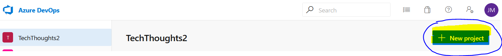
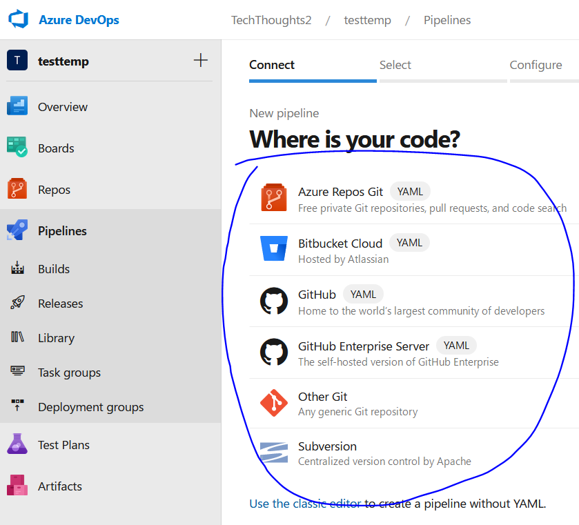
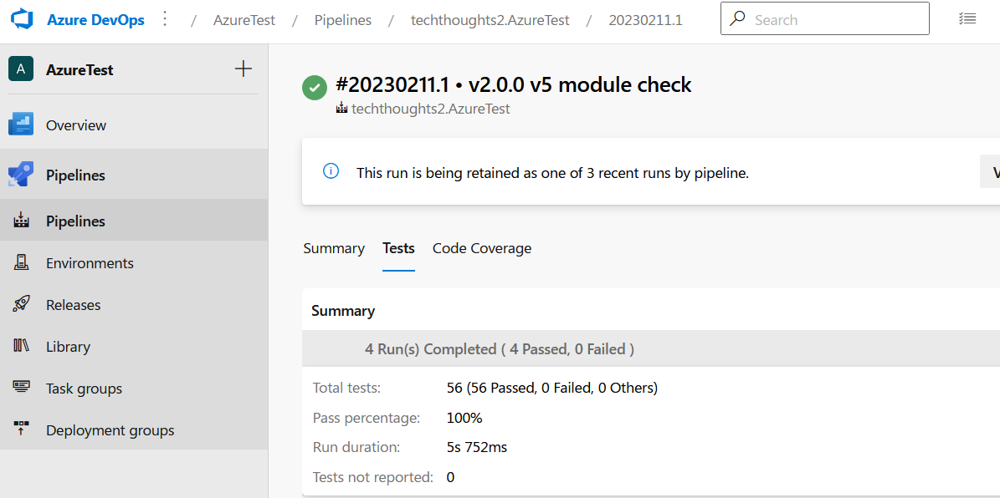
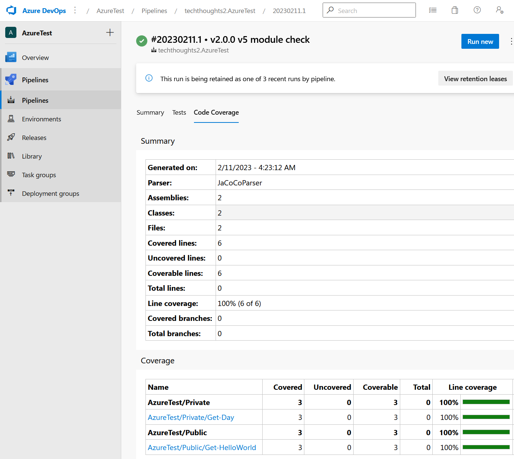
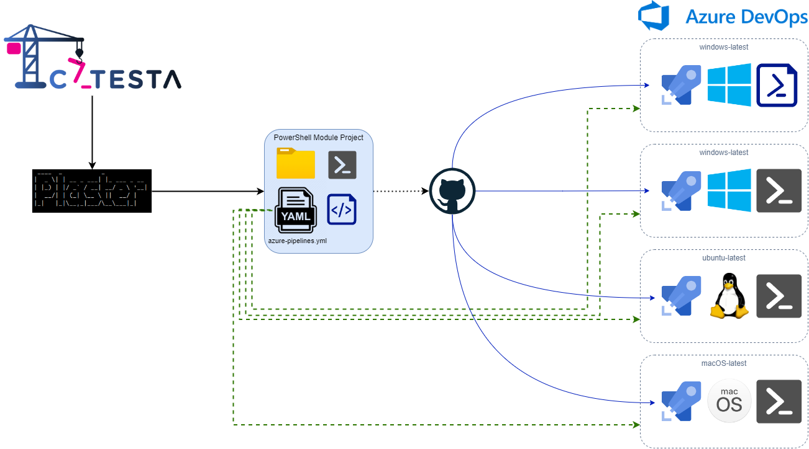

# Catesta - Azure Pipelines Integration

## Synopsis

Scaffolds a new PowerShell module or vault project intended for CI/CD workflow using [Azure Pipelines](https://azure.microsoft.com/services/devops/).

## Getting Started

-------------------

*Note: It is important to have a clear understanding of what your module should support before you begin your project with Catesta. IIf your module is designed to be cross-platform or you plan to test different versions of PowerShell, it is recommended to run multiple build types to cover different scenarios. This will help you validate that your module works as expected on different platforms and environments.*

-------------------

1. You will [need an Azure DevOps Organization](https://azure.microsoft.com/services/devops/).
1. Create a new Project:
    * 
1. Create a new pipeline and choose where your code will come from:
    * 
    * Authenticate to your repository source as needed
1. Create your project using Catesta and select `[A] Azure Pipelines` at the CICD prompt. *([Catesta Basics](../Catesta-Basics.md))*
1. Write the logic for your module (the hardest part)
    * All build testing can be done locally by navigating to `src` and running `Invoke-Build`
        * By default, this runs all tasks in the build file.
            * If you want to run a specific task from the build file you can provide the task name. For example, to just execute Pester tests for your project: `Invoke-Build -Task Test`
    * If using VSCode as your primary editor you can use VSCode tasks to perform various local actions
        * Open the VSCode Command palette
            * Shift+Command+P (Mac) / Ctrl+Shift+P (Windows/Linux) or F1
        * Type `Tasks: Run Task`
        * Select the task to run
            * Examples:
                * `task .` - Runs complete build (all tasks)
                * `task Test` - Invokes all Pester Unit Tests
                * `task Analyze` - Invokes Script Analyzer checks
                * `task DevCC` - Generates generate xml file to graphically display code coverage in VSCode using [Coverage Gutters](https://marketplace.visualstudio.com/items?itemName=ryanluker.vscode-coverage-gutters)
1. Add any module dependencies to your CI/CD bootstrap file: `actions_bootstrap.ps1`
1. Upload to your desired repository which now has a triggered/monitored build action.
1. Evaluate results of your build and display your Azure Pipelines badge proudly!

### Test Reports

Catesta automatically configures your Azure Pipelines PowerShell project to generate detailed Tests and Code Coverage reports:

## Notes

Additional Reading:

* [YAML schema reference](https://docs.microsoft.com/azure/devops/pipelines/yaml-schema?view=azure-devops&tabs=schema)
* [Use a Microsoft-hosted agent](https://docs.microsoft.com/azure/devops/pipelines/agents/hosted?view=azure-devops#use-a-microsoft-hosted-agent)
* [Predefined variables](https://docs.microsoft.com/azure/devops/pipelines/build/variables?view=azure-devops&tabs=yaml)

## Diagrams

### Azure DevOps Integration with GitHub

## Example Projects

* [PoshNotify](https://github.com/techthoughts2/PoshNotify)
