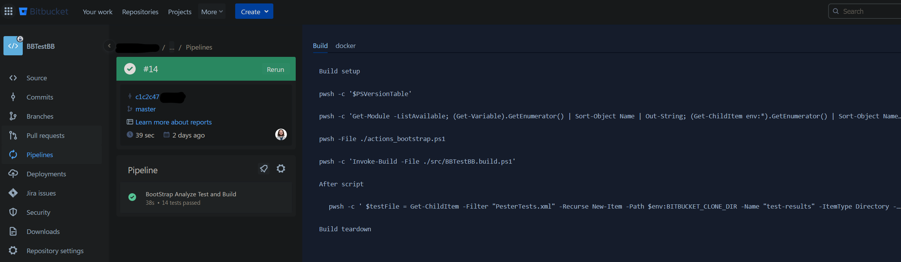
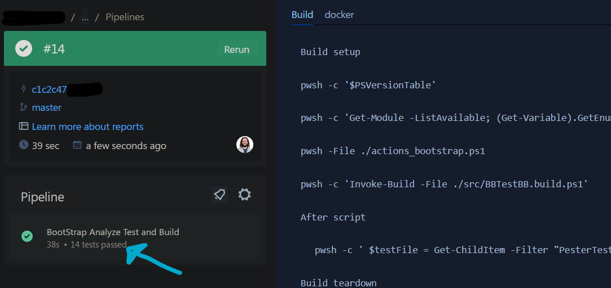
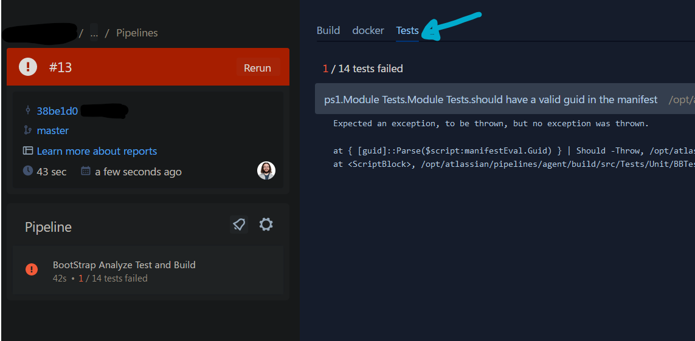
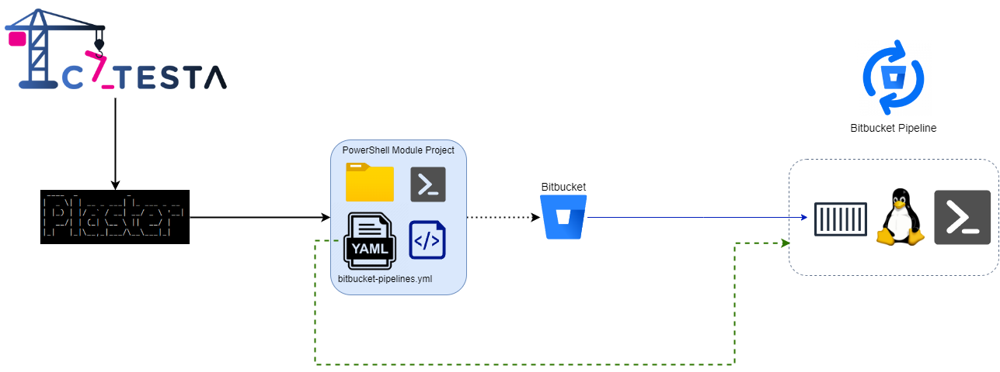

# Catesta - Bitbucket Pipelines Integration

## Synopsis

Scaffolds a new PowerShell module or vault project intended for CI/CD workflow using [Bitbucket](https://bitbucket.org/).

## Getting Started

-------------------

*Note: It's important to understand your project's requirements before choosing a CI/CD solution with Catesta. Bitbucket only natively supports Linux containers for builds, limiting your module to be built and tested on Linux using PowerShell. However, Bitbucket [recently announced](https://support.atlassian.com/bitbucket-cloud/docs/set-up-runners-for-windows/) support for [Windows runners](https://bitbucket.org/blog/windows-runners), allowing you to run builds on your own Windows infrastructure. Although Catesta can't scaffold for this scenario, there's nothing preventing a user from setting up their own Windows runner for their Catesta project.*

-------------------

1. You will need an [Atlassian account](https://id.atlassian.com/login?application=bitbucket).
1. Create a new Project/Repository:
    * 
    * *Note: To create a new repository in Bitbucket, you have two options: either create a new project and then a new repository within it, or create a new repository and associate it with a new project during the creation process.*
1. Create your project using Catesta and select `[B] Bitbucket` at the CICD prompt. *([Catesta Basics](../Catesta-Basics.md))*
1. Write the logic for your module (the hardest part)
    * All build testing can be done locally by navigating to `src` and running `Invoke-Build`
        * By default, this runs all tasks in the build file.
            * If you want to run a specific task from the build file you can provide the task name. For example, to just execute Pester tests for your project: `Invoke-Build -Task Test`
    * If using VSCode as your primary editor you can use VSCode tasks to perform various local actions
        * Open the VSCode Command palette
            * Shift+Command+P (Mac) / Ctrl+Shift+P (Windows/Linux) or F1
        * Type `Tasks: Run Task`
        * Select the task to run
            * Examples:
                * `task .` - Runs complete build (all tasks)
                * `task Test` - Invokes all Pester Unit Tests
                * `task Analyze` - Invokes Script Analyzer checks
                * `task DevCC` - Generates generate xml file to graphically display code coverage in VSCode using [Coverage Gutters](https://marketplace.visualstudio.com/items?itemName=ryanluker.vscode-coverage-gutters)
1. Add any module dependencies to your CI/CD bootstrap file: `actions_bootstrap.ps1`
1. Upload to your Bitbucket repository which now has a triggered/monitored build action.
1. Evaluate results of your build.

### Test Reports

Your Bitbucket Pipelines project is configured to generate test reports in `JUnitXml` format.

#### Passing Report

Bitbucket does not provide a detailed report when all tests are successful. You will only get an overview of the results report:

#### Failed Report

When you project experiences a failed tests Bitbucket will add a `Tests` tab to your pipeline. Here you will be able to see a detailed breakdown of which test(s_ experienced an issue.

## Notes

Additional Reading:

* [Configure your first pipeline](https://support.atlassian.com/bitbucket-cloud/docs/configure-your-first-pipeline/)
* [Bitbucket Pipelines configuration reference](https://support.atlassian.com/bitbucket-cloud/docs/bitbucket-pipelines-configuration-reference/)
* [Use Docker images as build environments - Using public build images](https://support.atlassian.com/bitbucket-cloud/docs/use-docker-images-as-build-environments/#Using-public-build-images)

## Diagrams

### AppVeyor Integration with GitHub

