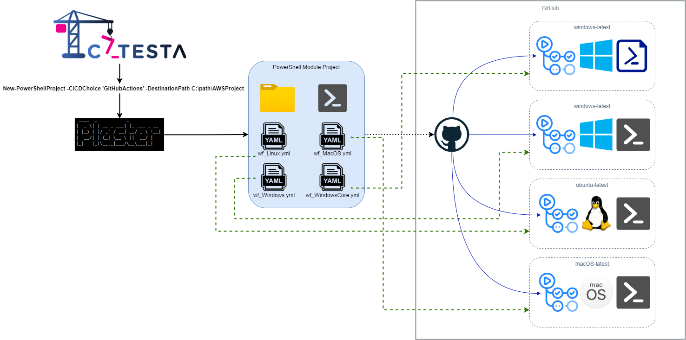

# Catesta - GitHub Actions Integration

## Synopsis

Scaffolds a new PowerShell module project intended for CI/CD workflow using [GitHub Actions](https://help.github.com/actions).

## Getting Started

-------------------

*Note: It is important to have a clear understanding of what your module should support before you begin your project with Catesta. IIf your module is designed to be cross-platform or you plan to test different versions of PowerShell, it is recommended to run multiple build types to cover different scenarios. This will help you validate that your module works as expected on different platforms and environments.*

-------------------

1. You will [need a GitHub account](https://github.com/join).
1. Create a new repository and clone to your local dev device
1. Create your project using Catesta and select `[G] GitHub Actions` at the CICD prompt. *([Catesta Basics](../Catesta-Basics.md))*
1. Write the logic for your module (the hardest part)
    * All build testing can be done locally by navigating to `src` and running `Invoke-Build`
        * By default, this runs all tasks in the build file.
            * If you want to run a specific task from the build file you can provide the task name. For example, to just execute Pester tests for your project: `Invoke-Build -Task Test`
    * If using VSCode as your primary editor you can use VSCode tasks to perform various local actions
        * Open the VSCode Command palette
            * Shift+Command+P (Mac) / Ctrl+Shift+P (Windows/Linux) or F1
        * Type `Tasks: Run Task`
        * Select the task to run
            * Examples:
                * `task .` - Runs complete build (all tasks)
                * `task Test` - Invokes all Pester Unit Tests
                * `task Analyze` - Invokes Script Analyzer checks
                * `task DevCC` - Generates generate xml file to graphically display code coverage in VSCode using [Coverage Gutters](https://marketplace.visualstudio.com/items?itemName=ryanluker.vscode-coverage-gutters)
1. *The comment based help in your functions will be used to generate/update markdown docs for your module in the docs folder.*
1. Add any module dependencies to your CI/CD bootstrap file: `actions_bootstrap.ps1`
1. Upload to your desired repository which now has a triggered/monitored build action.
1. Evaluate results of your build and display your GitHub Actions badge proudly!

## Notes

Additional Reading:

* [Automating your workflow with GitHub Actions](https://help.github.com/en/actions/automating-your-workflow-with-github-actions)
* [Virtual environments for GitHub-hosted runners](https://help.github.com/en/actions/automating-your-workflow-with-github-actions/virtual-environments-for-github-hosted-runners)
* [Software installed on GitHub-hosted runners](https://help.github.com/en/actions/automating-your-workflow-with-github-actions/software-installed-on-github-hosted-runners)
* [Using a specific shell](https://help.github.com/en/actions/automating-your-workflow-with-github-actions/workflow-syntax-for-github-actions#using-a-specific-shell)
* [Workflow syntax for GitHub Actions](https://help.github.com/en/actions/automating-your-workflow-with-github-actions/workflow-syntax-for-github-actions)
* [Where does the upload go?](https://docs.github.com/en/actions/automating-builds-and-tests/building-and-testing-powershell)
* [Building and testing PowerShell](https://github.com/actions/upload-artifact#where-does-the-upload-go)

## Diagrams

### GitHub Actions

## Example Projects

* [Catesta](https://github.com/techthoughts2/Catesta)
* [pwshPlaces](https://github.com/techthoughts2/pwshPlaces)
* [ApertaCookie](https://github.com/techthoughts2/ApertaCookie)
