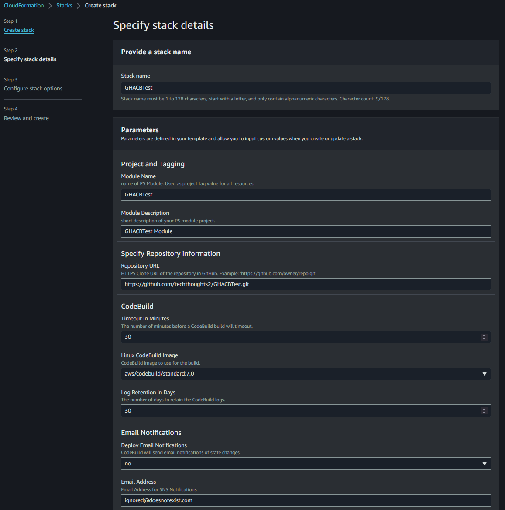
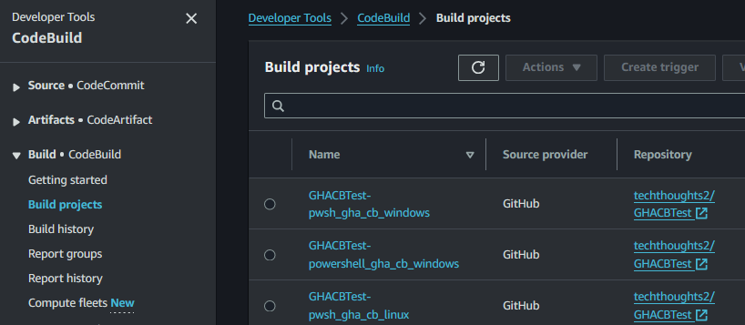
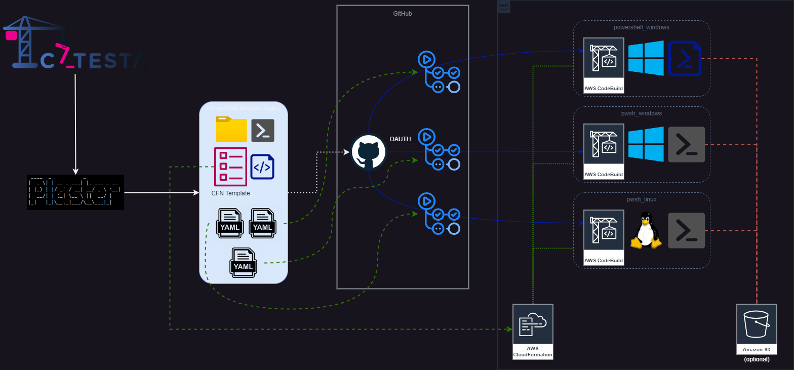

# Catesta - GitHub Actions with AWS CodeBuild Integration

## Synopsis

Scaffolds a new PowerShell module or vault project intended for CI/CD workflow using [GitHub Actions](https://help.github.com/actions) running on [AWS CodeBuild](https://aws.amazon.com/about-aws/whats-new/2023/07/aws-codebuild-github-actions/).

## Getting Started

-------------------

*Note: It is important to have a clear understanding of what your project should support before starting with Catesta. If your goal is to create a cross-platform solution or test multiple versions of PowerShell, consider running multiple build types to ensure proper functioning on various platforms and environments.*

GitHub Actions Supported Builds:

-------------------

1. You will [need an AWS Account](https://aws.amazon.com/premiumsupport/knowledge-center/create-and-activate-aws-account/).
1. You will [need a GitHub account](https://github.com/join).
1. Create a new repository and clone to your local dev device
1. Create your project using Catesta and select `[S] GitHub Actions on AWS CodeBuild` at the CICD prompt. *([Catesta Basics](../Catesta-Basics.md))*
1. Create your CodeBuild project(s) in your AWS account using the CloudFormation (CFN) template generated by Catesta. (*This is highly recommended as the naming convention of the projects must match your Action workflows exactly. Using the templates ensures this.*)
   * Upload the CFN template to AWS CloudFormation to deploy the required resources automatically. The template adapts to include support for any build types you've chosen during the Catesta setup, such as Windows, Linux, or macOS.
   * CodeBuild projects currently use OATH to authenticate with GitHub. **You need to configure OATH for CodeBuild *before* you deploy the CFN template**. *Reference [Adding CodeBuild OATH to your Project Repository](#adding-codebuild-oath-to-your-project-repository) below for configuring this.*
1. Write the logic for your module (the hardest part)
    * All build testing can be done locally by navigating to `src` and running `Invoke-Build`
        * By default, this runs all tasks in the build file.
            * If you want to run a specific task from the build file you can provide the task name. For example, to just execute Pester tests for your project: `Invoke-Build -Task Test`
    * If using VSCode as your primary editor you can use VSCode tasks to perform various local actions
        * Open the VSCode Command palette
            * Shift+Command+P (Mac) / Ctrl+Shift+P (Windows/Linux) or F1
        * Type `Tasks: Run Task`
        * Select the task to run
            * Examples:
                * `task .` - Runs complete build (all tasks)
                * `task Test` - Invokes all Pester Unit Tests
                * `task Analyze` - Invokes Script Analyzer checks
                * `task DevCC` - Generates generate xml file to graphically display code coverage in VSCode using [Coverage Gutters](https://marketplace.visualstudio.com/items?itemName=ryanluker.vscode-coverage-gutters)
1. Add any module dependencies to your CI/CD bootstrap file: `actions_bootstrap.ps1`
1. Upload to your GitHub repository which now has a triggered/monitored build action that runs in CodeBuild in your AWS account.
1. Evaluate results of your build and display your GitHub Actions badge proudly!

### Test Reports

GitHub Actions does not natively support Test reports. There are many Test Report solutions in the [Actions Marketplace](https://github.com/marketplace?type=actions) that can accomplish this however.

By default, the build file will create a XML test report in `NUnitXml` but these can also be changed to `JUnitXml` if you are using a Test Report in Actions that prefers that format.

## Notes

Additional Reading:

* [Set up self-hosted GitHub Actions runners in AWS CodeBuild](https://docs.aws.amazon.com/codebuild/latest/userguide/action-runner.html)
* [Automating your workflow with GitHub Actions](https://help.github.com/en/actions/automating-your-workflow-with-github-actions)
* [Using a specific shell](https://help.github.com/en/actions/automating-your-workflow-with-github-actions/workflow-syntax-for-github-actions#using-a-specific-shell)
* [Workflow syntax for GitHub Actions](https://help.github.com/en/actions/automating-your-workflow-with-github-actions/workflow-syntax-for-github-actions)

### Deploying the CFN (CloudFormation) Template

#### Adding CodeBuild OATH to your Project Repository

AWS documentation for [ProjectSource](https://docs.aws.amazon.com/codebuild/latest/APIReference/API_ProjectSource.html) states that OAUTH should be set for GitHub.

In order to accomplish [source provider access](https://docs.aws.amazon.com/codebuild/latest/userguide/access-tokens.html#access-tokens-github) to your project's repo using OATH, you will first need to configure CodeBuild in the AWS Console.

This needs to be done **prior to deploying your CFN template**.

Essentially, you just need to login to your AWS console, create a new CodeBuild project, and under source, add a source to your supported repository location. You will be prompted to enter your credentials to establish a link. Once complete, CodeBuild will be aware of this OATH link. You do not actually need to create the project in the console. Once you've created the OATH link, you can click Cancel on the new CodeBuild project creation page.

The graphic below shows a Bitbucket example, but the same applies for GitHub, just select GitHub as your source provider.

#### Manual CFN upload example

The following shows the GitHub CFN example:

#### Final CFN Deployment Results example

## Diagrams

### GitHub Actions with AWS CodeBuild Integration

