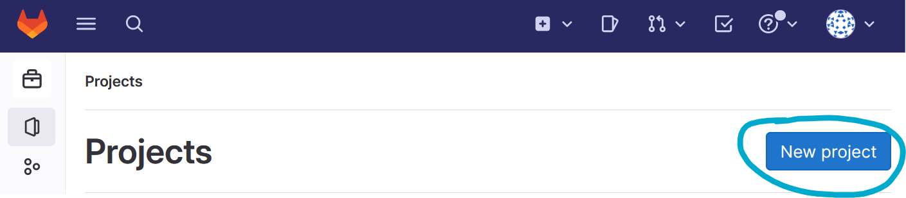
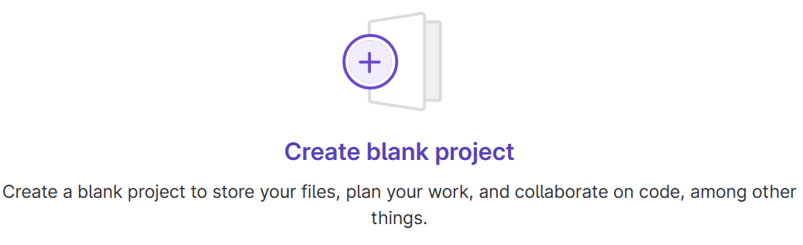
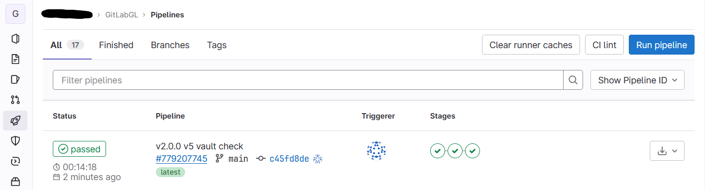
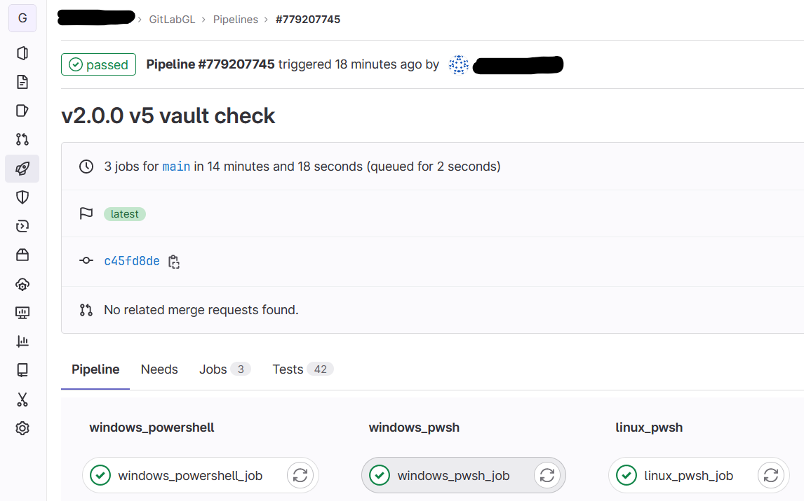
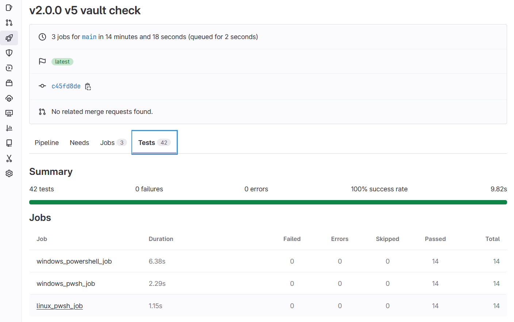
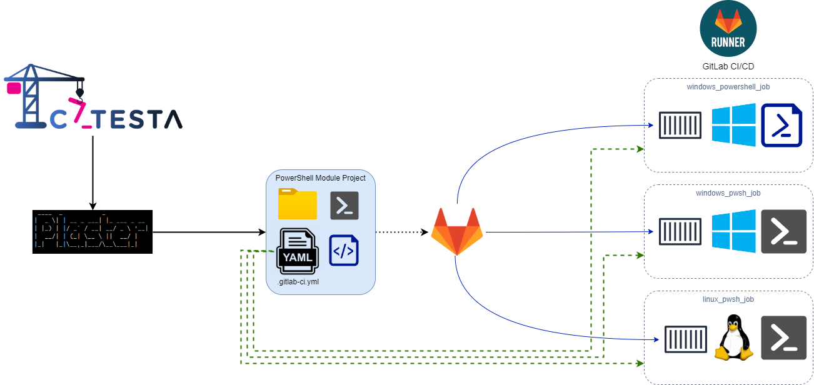

# Catesta - GitLab Integration

## Synopsis

Scaffolds a new PowerShell module or vault project intended for CI/CD workflow using [GitLab](https://docs.gitlab.com/ee/ci/) .

## Getting Started

-------------------

*Note: It is important to have a clear understanding of what your project should support before starting with Catesta. If your goal is to create a cross-platform solution or test multiple versions of PowerShell, consider running multiple build types to ensure proper functioning on various platforms and environments.*

*MacOS support for GitLab is currently is in [premium beta](https://docs.gitlab.com/ee/ci/runners/saas/macos_saas_runner.html).*

GitLab Supported Builds:

-------------------

1. You will need an [GitLab account](https://gitlab.com/users/sign_in).
1. Create a new project:
    * 
1. Create a blank project:
    * 
    * Authenticate to your repository source as needed
1. Create your project using Catesta and select `[L] GitLab` at the CICD prompt. *([Catesta Basics](../Catesta-Basics.md))*
1. Write the logic for your module (the hardest part)
    * All build testing can be done locally by navigating to `src` and running `Invoke-Build`
        * By default, this runs all tasks in the build file.
            * If you want to run a specific task from the build file you can provide the task name. For example, to just execute Pester tests for your project: `Invoke-Build -Task Test`
    * If using VSCode as your primary editor you can use VSCode tasks to perform various local actions
        * Open the VSCode Command palette
            * Shift+Command+P (Mac) / Ctrl+Shift+P (Windows/Linux) or F1
        * Type `Tasks: Run Task`
        * Select the task to run
            * Examples:
                * `task .` - Runs complete build (all tasks)
                * `task Test` - Invokes all Pester Unit Tests
                * `task Analyze` - Invokes Script Analyzer checks
                * `task DevCC` - Generates generate xml file to graphically display code coverage in VSCode using [Coverage Gutters](https://marketplace.visualstudio.com/items?itemName=ryanluker.vscode-coverage-gutters)
1. Add any module dependencies to your CI/CD bootstrap file: `actions_bootstrap.ps1`
1. Upload to your GitLab repository which now has a triggered/monitored build action.
1. Evaluate results of your build and display your GitLab CI pipeline status badge proudly!

### Test Reports

Catesta automatically configures your GitLab PowerShell project to generate detailed Tests reports:

Code Coverage reports are not currently possible as GitLab expects Cobertura format which [Pester does not currently support](https://github.com/pester/Pester/issues/2203).

## Notes

Additional Reading:

* [GitLab CI/CD](https://docs.gitlab.com/ee/ci/)
* [The .gitlab-ci.yml file](https://docs.gitlab.com/ee/ci/yaml/gitlab_ci_yaml.html)
* [.gitlab-ci.yml keyword reference](https://docs.gitlab.com/ee/ci/yaml/index.html)
* [SaaS runners on Windows](https://docs.gitlab.com/ee/ci/runners/saas/windows_saas_runner.html)
* [Unit test reports](https://docs.gitlab.com/ee/ci/testing/unit_test_reports.html)

## Diagrams

### GitLab CICD Pipelines

